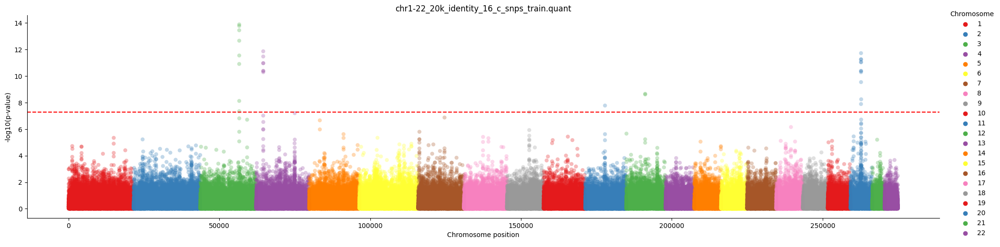
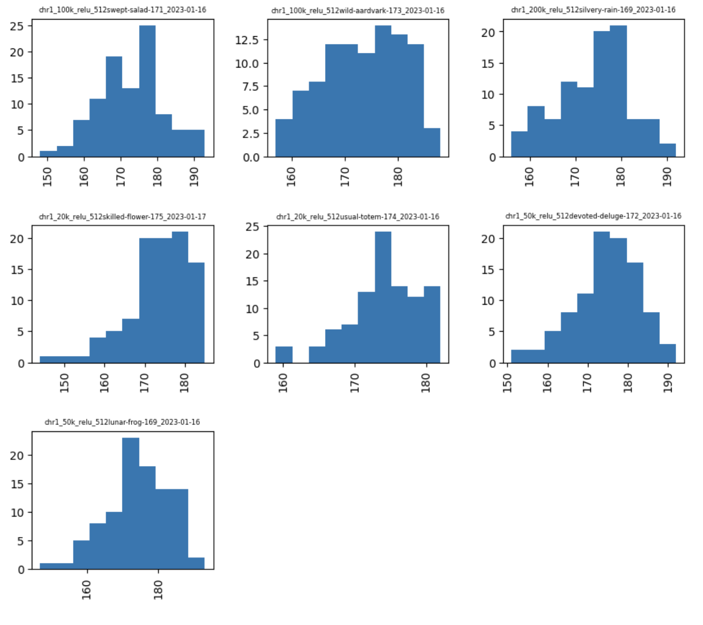

# Report
Status on the project so far.

## Project
Central idea of the project.

- Is it possible to meaningfully compress single nucleotide polymorphism (SNP) data?
  - Is there a potential benefit for using a non-linear compression

## Single cSNP analysis
A single SNP analysis performed on compressed SNP (cSNPs).




## Single SNP analysis


### Comparison

| Activation | Stride/width | Compression factor | N significant (p < 5x10^-8) | Expected N given number of SNPs | N significant / expected |
| ---------- | ------------ | ------------------ | --------------------------- | ------------------------------- | ------------------------ |
| Identity   | 16           | 2x                 | 29                          | 0.013748                        | **2109.2903**            |
| Identity   | 512          | 2x                 | 7                           | 0.015503                        | 451.4963                 |
| ReLU       | 16           | 2x                 | 20                          | 0.013748                        | 1454.6829                |
| ReLU       | 512          | 2x                 | 1                           | 0.015503                        | 64.4994                  |
|            |              | Uncompressed       | 50                          | 0.03143                         | 1590.5989                |


<details>
<summary>Raw output</summary>
```bash
chr1-22_20k_identity_16_c_snps_train.quant - 0 / 4
        N significant (p < 5x10^-8): 29
        Expected N given number of SNPs: 0.013748699999999999
        N significant / expected:  2109.290332904202
chr1-22_20k_identity_512_c_snps_train.quant - 1 / 4
        N significant (p < 5x10^-8): 7
        Expected N given number of SNPs: 0.015503999999999999
        N significant / expected:  451.4963880288958
chr1-22_20k_relu_16_c_snps_train.quant - 2 / 4
        N significant (p < 5x10^-8): 20
        Expected N given number of SNPs: 0.013748699999999999
        N significant / expected:  1454.6829882097945
chr1-22_20k_relu_512_c_snps_train.quant - 3 / 4
        N significant (p < 5x10^-8): 1
        Expected N given number of SNPs: 0.015503999999999999
        N significant / expected:  64.49948400412798
geno.quant - 4 / 5
        N significant (p < 5x10^-8): 50
        Expected N given number of SNPs: 0.031434699999999996
        N significant / expected:  1590.598924118888
```
</details>


## REML

Analysis performed on Chromosome 1-22 using 20k participants derived from 4 different compression:

| Input size | Activation Function | Compression factor (intended) | Heritability |
| ---------- | ------------------- | ----------------------------- | ------------ |
| 16         | Identity            | 2x                            | 0.60         |
| 512        | Identity            | 2x                            | 0.54         |
| 16         | ReLU                | 2x                            | 0.59         |
| 512        | ReLU                | 2x                            | 0.55         |
|            |                     | Uncompressed                  | **0.82**     |


For more details you can inspect the following outputs from LDAK.
The model was performed under the GCTA model.


<details>
    <summary> LDAK Outputs </summary>

chr1-22_20k_identity_16_c_snps_train.reml1.reml
```bash
Num_Kinships 1
Num_Regions 0
Num_Top_Predictors 0
Num_Covariates 1
Num_Environments 0
Blupfile /home/kce/NLPPred/github/snip/data/ldak_results/chr1-22_20k_identity_16_c_snps_train.reml1.indi.blp
Regfile none
Coeffsfile /home/kce/NLPPred/github/snip/data/ldak_results/chr1-22_20k_identity_16_c_snps_train.reml1.coeff
Covar_Heritability 0.0000
Total_Samples 12862
With_Phenotypes 12862
Converged YES
Null_Likelihood -18297.3966
Alt_Likelihood -18054.2041
LRT_Stat 486.3851
LRT_P 4.3587e-108
Component Heritability SD Size Mega_Intensity SD
Her_K1 0.604960 0.027899 274974.00 2.200062 0.101461
Her_Top 0.000000 NA NA NA NA
Her_All 0.604960 0.027899 274974.00 2.200062 0.101461
```

chr1-22_20k_identity_512_c_snps_train.reml1.reml
```
Num_Kinships 1
Num_Regions 0
Num_Top_Predictors 0
Num_Covariates 1
Num_Environments 0
Blupfile /home/kce/NLPPred/github/snip/data/ldak_results/chr1-22_20k_identity_512_c_snps_train.reml1.indi.blp
Regfile none
Coeffsfile /home/kce/NLPPred/github/snip/data/ldak_results/chr1-22_20k_identity_512_c_snps_train.reml1.coeff
Covar_Heritability 0.0000
Total_Samples 12862
With_Phenotypes 12862
Converged YES
Null_Likelihood -18297.3966
Alt_Likelihood -18065.9040
LRT_Stat 462.9853
LRT_P 5.3854e-103
Component Heritability SD Size Mega_Intensity SD
Her_K1 0.544225 0.026037 310080.00 1.755113 0.083969
Her_Top 0.000000 NA NA NA NA
Her_All 0.544225 0.026037 310080.00 1.755113 0.083969
```


chr1-22_20k_relu_16_c_snps_train.reml1.reml
```
Num_Kinships 1
Num_Regions 0
Num_Top_Predictors 0
Num_Covariates 1
Num_Environments 0
Blupfile /home/kce/NLPPred/github/snip/data/ldak_results/chr1-22_20k_relu_16_c_snps_train.reml1.indi.blp
Regfile none
Coeffsfile /home/kce/NLPPred/github/snip/data/ldak_results/chr1-22_20k_relu_16_c_snps_train.reml1.coeff
Covar_Heritability 0.0000
Total_Samples 12862
With_Phenotypes 12862
Converged YES
Null_Likelihood -18297.3966
Alt_Likelihood -18068.0603
LRT_Stat 458.6727
LRT_P 4.6741e-102
Component Heritability SD Size Mega_Intensity SD
Her_K1 0.587304 0.027586 188901.00 3.109058 0.146037
Her_Top 0.000000 NA NA NA NA
Her_All 0.587304 0.027586 188901.00 3.109058 0.146037
```


chr1-22_20k_relu_512_c_snps_train.reml1.reml
```
Num_Kinships 1
Num_Regions 0
Num_Top_Predictors 0
Num_Covariates 1
Num_Environments 0
Blupfile /home/kce/NLPPred/github/snip/data/ldak_results/chr1-22_20k_relu_512_c_snps_train.reml1.indi.blp
Regfile none
Coeffsfile /home/kce/NLPPred/github/snip/data/ldak_results/chr1-22_20k_relu_512_c_snps_train.reml1.coeff
Covar_Heritability 0.0000
Total_Samples 12862
With_Phenotypes 12862
Converged YES
Null_Likelihood -18297.3966
Alt_Likelihood -18071.5190
LRT_Stat 451.7553
LRT_P 1.4965e-100
Component Heritability SD Size Mega_Intensity SD
Her_K1 0.553665 0.026147 100962.00 5.483895 0.258981
Her_Top 0.000000 NA NA NA NA
Her_All 0.553665 0.026147 100962.00 5.483895 0.258981
```

And based on the raw uncompressed SNPs:
```
Num_Kinships 1
Num_Regions 0
Num_Top_Predictors 0
Num_Covariates 1
Num_Environments 0
Blupfile /home/kce/NLPPred/github/snip/data/ldak_results/geno.reml1.indi.blp
Regfile none
Coeffsfile /home/kce/NLPPred/github/snip/data/ldak_results/geno.reml1.coeff
Covar_Heritability 0.0000
Total_Samples 12862
With_Phenotypes 12862
Converged YES
Null_Likelihood -18297.3966
Alt_Likelihood -18055.7829
LRT_Stat 483.2274
LRT_P 2.1205e-107
Component Heritability SD Size Mega_Intensity SD
Her_K1 0.824049 0.037624 628028.73 1.312120 0.059908
Her_Top 0.000000 NA NA NA NA
Her_All 0.824049 0.037624 628028.73 1.312120 0.05990
```


</details>


This assumes the model:

$$
y = \beta_0 + \beta_1 x_1 + ... + \beta_n x_n + \epsilon = X\beta + \epsilon
$$

Where:
$$
\beta_j \sim N(0, K\sigma^2)
$$
    
$$
\epsilon \sim N(0, \sigma^2_\epsilon)
$$

Where $K$ is the kinship matrix.

We can thus describe $y$ as:

$$
y \sim N(\beta_0, K\sigma^2 + I\sigma^2_\epsilon)
$$

Where $K$ is the kinship matrix and $\epsilon$ is the residual error.

Heritability is then defined as:

$$
h^2 = \frac{\sigma^2}{\sigma^2 + \sigma^2_\epsilon}
$$


# compression quality

The compression is performed using a simple autoencoder with 3 hidden layers. All
networks use a compression factor of 2x and are run independently for each chromosome on
using a width and stride of 16 or 512 and using either a ReLU or Identity (PCA) activation function.

Reconstruction error is calucated as follows:
$$
reconstruction \quad error = mean((X-\hat{X})^2)
$$


<details>
    <summary> Raw outputs </summary>

```bash
chr1, width 512
Max(training reconstruction error) 0.06596
Max(validation reconstruction error) 0.06674
Mean(training reconstruction error) 0.04048
Mean(valilidation reconstruction error) 0.04102
Min(training reconstruction error) 0.02018
Min(validation reconstruction error) 0.02043
N models 96

chr1, width 16
Max(training reconstruction error) 0.20218
Max(validation reconstruction error) 0.20127
Mean(training reconstruction error) 0.03809
Mean(valilidation reconstruction error) 0.03813
Min(training reconstruction error) 0.00079
Min(validation reconstruction error) 0.0007
N models 3084

chr2, width 512
Max(training reconstruction error) 0.06197
Max(validation reconstruction error) 0.06257
Mean(training reconstruction error) 0.03966
Mean(valilidation reconstruction error) 0.04018
Min(training reconstruction error) 0.01764
Min(validation reconstruction error) 0.01788
N models 98

chr2, width 16
Max(training reconstruction error) 0.23926
Max(validation reconstruction error) 0.23852
Mean(training reconstruction error) 0.03758
Mean(valilidation reconstruction error) 0.03762
Min(training reconstruction error) 0.00103
Min(validation reconstruction error) 0.00106
N models 3156

chr3, width 512
Max(training reconstruction error) 0.0802
Max(validation reconstruction error) 0.08107
Mean(training reconstruction error) 0.04134
Mean(valilidation reconstruction error) 0.04188
Min(training reconstruction error) 0.01142
Min(validation reconstruction error) 0.01149
N models 82

chr3, width 16
Max(training reconstruction error) 0.20604
Max(validation reconstruction error) 0.20515
Mean(training reconstruction error) 0.03766
Mean(valilidation reconstruction error) 0.03768
Min(training reconstruction error) 0.00098
Min(validation reconstruction error) 0.00095
N models 2646

chr4, width 512
Max(training reconstruction error) 0.06998
Max(validation reconstruction error) 0.07075
Mean(training reconstruction error) 0.03995
Mean(valilidation reconstruction error) 0.04047
Min(training reconstruction error) 0.01751
Min(validation reconstruction error) 0.01774
N models 78

chr4, width 16
Max(training reconstruction error) 0.17086
Max(validation reconstruction error) 0.16949
Mean(training reconstruction error) 0.03775
Mean(valilidation reconstruction error) 0.03776
Min(training reconstruction error) 0.0012
Min(validation reconstruction error) 0.00118
N models 2511

And a similar tendency is seen from 5-22.
```

To see all check the logs in the git history.

</details>


# Time requirements

For running the compression using a width of 512 a ReLU activation and 20k individuals:

```bash
Min(time taken) 178.21815
Mean(time taken) 1220.06111
Max(time taken) 1701.23619
```


Running it for 50k individuals:
```bash
Min(time taken) 282.9348
Mean(time taken) 940.33121
Max(time taken) 1315.15438
```

Running it for 100k individuals:

```bash
Min(time taken) 199.60055
Mean(time taken) 1222.3906
Max(time taken) 2836.58991
```

Running it for 200k individuals:

```bash
Min(time taken) 488.47311
Mean(time taken) 2703.75062
Max(time taken) 4785.77009
```


The reported is time taken in seconds.


# Comparison with Pruning
Copied in from e-mail from Doug Speed to Kenneth Enevoldsen:


<details>
    <summary> e-mail </summary>

```
I have run the pruning (although might have to repeat if I used the wrong files)

Here is a summary
wc -l pru*in 
  110518 prune.05.in
  161823 prune.1.in
  240241 prune.2.in
  427382 prune.5.in
  548905 prune.8.in

So pruning with r2 =0.2 results in 240k snps remaining , and r2=.1 means 160k remain (so we could test whether compressing is more efficient than pruning)

here are the scripts


#kenneth3.txt - do pruning 

srun --mem=16g -c 2 --pty /bin/bash

################

cd /home/doug/NLPPred/doug

#kenneth gave list of 20k individuals - prune these with different r2 values
#(have picked .8, .5, .2, .1 and .05 - but can change later)

echo "#"'!'"/bin/bash
#SBATCH --mem 15G
#SBATCH -t 2:0:0
#SBATCH -c 2
#SBATCH --constraint \"s05\"

/home/doug/ldak5.2.linux --thin prune.8 --bfile /home/doug/dsmwpred/data/ukbb/geno --max-threads 2 --keep /home/doug/NLPPred/github/snip/data/compressed/whole_geno/combined_sped/chr1-22_20k_identity_16_c_snps_test.fam --window-cm 1 --window-prune .8

/home/doug/ldak5.2.linux --thin prune.5 --bfile /home/doug/dsmwpred/data/ukbb/geno --max-threads 2 --keep /home/doug/NLPPred/github/snip/data/compressed/whole_geno/combined_sped/chr1-22_20k_identity_16_c_snps_test.fam --window-cm 1 --window-prune .5 --extract prune.8.in

/home/doug/ldak5.2.linux --thin prune.2 --bfile /home/doug/dsmwpred/data/ukbb/geno --max-threads 2 --keep /home/doug/NLPPred/github/snip/data/compressed/whole_geno/combined_sped/chr1-22_20k_identity_16_c_snps_test.fam --window-cm 1 --window-prune .2 --extract prune.5.in

/home/doug/ldak5.2.linux --thin prune.1 --bfile /home/doug/dsmwpred/data/ukbb/geno --max-threads 2 --keep /home/doug/NLPPred/github/snip/data/compressed/whole_geno/combined_sped/chr1-22_20k_identity_16_c_snps_test.fam --window-cm 1 --window-prune .1 --extract prune.2.in

/home/doug/ldak5.2.linux --thin prune.05 --bfile /home/doug/dsmwpred/data/ukbb/geno --max-threads 2 --keep /home/doug/NLPPred/github/snip/data/compressed/whole_geno/combined_sped/chr1-22_20k_identity_16_c_snps_test.fam --window-cm 1 --window-prune .05 --extract prune.1.in

" > scripts/thin

chmod a+x scripts/thin
```

> *NOTE*: These were performed using the test individuals not the train.

</details>

# Correlation between decompressed and raw SNPs

After training we test the pearson correlation between the decompressed and raw SNPs on the training set:


For running the compression using a width of 512 a ReLU activation and 20k individuals:
```
Max(training correlation) 0.99804
Mean(training correlation) 0.00515
Min(training correlation) -0.99339
```

Using 100k individuals:
```
Max(training correlation) 0.99824
Mean(training correlation) 0.00507
Min(training correlation) -0.99009
```
This might indicate that there are areas where compression is not possible, while other
areas are highly compressible without notably loss of information.

## Correlation pr. for invdividuals

Mean correlation pr. individual for the training set:
```
path
chr1_100k_relu_512swept-salad-171_2023-01-16      0.922353
chr1_100k_relu_512wild-aardvark-173_2023-01-16    0.922274
chr1_200k_relu_512silvery-rain-169_2023-01-16     0.928858
chr1_20k_relu_512skilled-flower-175_2023-01-17    0.921989
chr1_20k_relu_512usual-totem-174_2023-01-16       0.921541
chr1_50k_relu_512devoted-deluge-172_2023-01-16    0.919716
chr1_50k_relu_512lunar-frog-169_2023-01-16        0.920183
Name: mean individual correlation (training set), dtype: float64
```


**In the following plot we see the distribution of correlations pr. individual**


The correlation metrics used is the pearson correlation coefficient.

## Correlation pr. SNP


The correlation metrics used is the pearson correlation coefficient.


# On Trivial SNPs


The distribution of trivial snps for each submodel (512 snps width) for each model (each model is run on all of chr1) using 20k, 50k, 100k or 200k individuals.

# Question by Doug and answers

- What is the role of the kinship matrix in the model? (what is the role of $K$?)

The role of the kinship matrix $K$ is to capture the genetic relatedness between
individuals. This is important because we want to capture the genetic relatedness
between individuals in our model. If we don't capture this, we will get a biased
estimate of the heritability.

- How do you specify the kinship matrix in the model? (how do you set $K$?)

Using the flag `--grm` in `ldak` we can specify the kinship matrix. This is
calculated using the `ldak --calc-tagging` command.

- What did we use for the kinship matrix? (what is the role of $K$?)
  
We use the kinship matrix calculated from the data using the `ldak --calc-tagging`
command with `--ignore-weights YES` (I am a bit unsure of what this does - the `--power`
already provided the wieghting - is this an additional weight before the GCTA weighting) 
and `--power -1` (GCTA / naive). I am a bit unsure how this is done.


# TODO

- [ ] Check relu compression (why is there trivial SNPs?)
  - [x] Started a test with 50k, 100k and all individuals for relu with 512 width for chr 1 (assuming more ind. will remove trivial cSNPs)
    - [ ] if this does not work try to see if the reducing the size resolves the issue or removing the dropout
- [ ] Redo analysis with more ind.
  - [x] time estimate (for compression?)
    - [x] Adding logging of time taken for compression, see section "Time requirements"
  - [ ]  more traits (e.g. Doug Speed will send a path for the bloodsamples)
- [ ] compare w. R^2 pruning
- [ ] Check with clumping on single SNPs, see mail from doug:

<details>
<summary>Mail from Doug</summary>

Thanks for the single-snp results. As well as total number significant predictors, I think it will be useful to have number of approximately independent significant predictors (as if there are, say, 80 significant, this could be 80 unique, or a few hits in ld regions). This is probably only an issue for the snp data (as I guess the compressions are by default almost indendent)
(this idea of clumping snps was described in slides 1b of your gwas course)

</details>

### Done / Answered
- [x] Do a single snp analysis with the same number of individuals
  - Added to the report under the section "single snp analysis"
- [x] Plot Single SNPs
- [x] Figure out the role of the Q_J (examine)
- [x] Calculate correlation
  - [x] Added calculation of correlation to the script (only for training data), see section "Correlation between decompressed and raw SNPs". 
- [x] Check visualization, is there a even amount of c snps pr. chromosome?
  -  It was caused by a normalization of the snps. I should have updated the plots now.
- [x] question: does it hit the max number of iterations?
  - Answer: All models converged.

## central question:
The fundamental question we are asking is, "are these compressions useful". Do they provide any benefits over having SNP data? So please think how we can answer this question. Ultimately, it is ok if the answer is "no", provided we are confident we have tried hard enough.  


----

# Multiple phenotypes analysis
All performed on Chromosome 1-22 using 20k individuals.

## Single SNP analysis
Due to space I have not included the plots for the single SNP analysis, but you can see the individual plots in the `./images/figures/single_snp_analysis` folder.


### Table 1

**width**: is the width of the autoencoder model.
**activation**: is the activation function used in the model.
**heritability** is the heritability obtained using the `ldak --reml` command assuming the GCTA model.


| compression       | activation | width | pheno       | N significant (p < 5x10^-8) | Expected N given number of SNPs | N significant / expected | heritability |
| :---------------- | :--------- | :---- | :---------- | --------------------------: | ------------------------------: | -----------------------: | -----------: |
| Autoencoder       | identity   | 16    | alkaline    |                          88 |                       0.0137487 |                  6400.61 |     0.217275 |
| Autoencoder       | identity   | 16    | bilirubin   |                          60 |                       0.0137487 |                  4364.05 |     0.577245 |
| Autoencoder       | identity   | 16    | cholesterol |                          51 |                       0.0137487 |                  3709.44 |     0.197577 |
| Autoencoder       | identity   | 16    | hba1c       |                           8 |                       0.0137487 |                  581.873 |     0.160755 |
| Autoencoder       | identity   | 16    | height      |                          56 |                       0.0137487 |                  4073.11 |     0.567587 |
| Autoencoder       | identity   | 16    | urate       |                          77 |                       0.0137487 |                  5600.53 |     0.303026 |
| Autoencoder       | identity   | 512   | alkaline    |                          88 |                        0.015504 |                  5675.95 |     0.231631 |
| Autoencoder       | identity   | 512   | bilirubin   |                         201 |                        0.015504 |                  12964.4 |     0.545401 |
| Autoencoder       | identity   | 512   | cholesterol |                          35 |                        0.015504 |                  2257.48 |     0.184681 |
| Autoencoder       | identity   | 512   | hba1c       |                           0 |                        0.015504 |                        0 |      0.13631 |
| Autoencoder       | identity   | 512   | height      |                          17 |                        0.015504 |                  1096.49 |     0.514717 |
| Autoencoder       | identity   | 512   | urate       |                         136 |                        0.015504 |                  8771.93 |     0.274293 |
| Autoencoder       | relu       | 16    | alkaline    |                          71 |                       0.0137487 |                  5164.12 |     0.218466 |
| Autoencoder       | relu       | 16    | bilirubin   |                          50 |                       0.0137487 |                  3636.71 |     0.544057 |
| Autoencoder       | relu       | 16    | cholesterol |                          32 |                       0.0137487 |                  2327.49 |     0.177689 |
| Autoencoder       | relu       | 16    | hba1c       |                          18 |                       0.0137487 |                  1309.21 |     0.149087 |
| Autoencoder       | relu       | 16    | height      |                          39 |                       0.0137487 |                  2836.63 |     0.525311 |
| Autoencoder       | relu       | 16    | urate       |                          58 |                       0.0137487 |                  4218.58 |     0.270907 |
| Autoencoder       | relu       | 512   | alkaline    |                          22 |                        0.015504 |                  1418.99 |     0.253273 |
| Autoencoder       | relu       | 512   | bilirubin   |                          68 |                        0.015504 |                  4385.96 |     0.484175 |
| Autoencoder       | relu       | 512   | cholesterol |                          11 |                        0.015504 |                  709.494 |     0.174309 |
| Autoencoder       | relu       | 512   | hba1c       |                           7 |                        0.015504 |                  451.496 |       0.1354 |
| Autoencoder       | relu       | 512   | height      |                           7 |                        0.015504 |                  451.496 |     0.513571 |
| Autoencoder       | relu       | 512   | urate       |                          39 |                        0.015504 |                  2515.48 |     0.265469 |
| Pruning (r2=0.05) |            |       | alkaline    |                           1 |                       0.0039545 |                  252.876 |     0.340562 |
| Pruning (r2=0.1)  |            |       | alkaline    |                           3 |                       0.0068811 |                  435.977 |     0.340562 |
| Pruning (r2=0.2)  |            |       | alkaline    |                           8 |                       0.0115781 |                   690.96 |     0.340562 |
| Pruning (r2=0.5)  |            |       | alkaline    |                          20 |                       0.0212917 |                  939.333 |     0.340562 |
| Pruning (r2=0.8)  |            |       | alkaline    |                          38 |                       0.0274442 |                  1384.63 |     0.340562 |
| Pruning (r2=0.05) |            |       | bilirubin   |                           4 |                       0.0039545 |                  1011.51 |     0.768607 |
| Pruning (r2=0.1)  |            |       | bilirubin   |                           9 |                       0.0068811 |                  1307.93 |     0.768607 |
| Pruning (r2=0.2)  |            |       | bilirubin   |                          19 |                       0.0115781 |                  1641.03 |     0.768607 |
| Pruning (r2=0.5)  |            |       | bilirubin   |                          55 |                       0.0212917 |                  2583.17 |     0.768607 |
| Pruning (r2=0.8)  |            |       | bilirubin   |                          76 |                       0.0274442 |                  2769.26 |     0.768607 |
| Pruning (r2=0.05) |            |       | cholesterol |                           3 |                       0.0039545 |                  758.629 |     0.302432 |
| Pruning (r2=0.1)  |            |       | cholesterol |                           4 |                       0.0068811 |                  581.302 |     0.302432 |
| Pruning (r2=0.2)  |            |       | cholesterol |                          10 |                       0.0115781 |                    863.7 |     0.302432 |
| Pruning (r2=0.5)  |            |       | cholesterol |                          18 |                       0.0212917 |                    845.4 |     0.302432 |
| Pruning (r2=0.8)  |            |       | cholesterol |                          31 |                       0.0274442 |                  1129.56 |     0.302432 |
| Pruning (r2=0.05) |            |       | hba1c       |                           0 |                       0.0039545 |                        0 |     0.223455 |
| Pruning (r2=0.2)  |            |       | hba1c       |                           2 |                       0.0115781 |                   172.74 |     0.223455 |
| Pruning (r2=0.5)  |            |       | hba1c       |                           2 |                       0.0212917 |                  93.9333 |     0.223455 |
| Pruning (r2=0.8)  |            |       | hba1c       |                           2 |                       0.0274442 |                  72.8751 |     0.223455 |
| Pruning (r2=0.05) |            |       | height      |                           1 |                       0.0039545 |                  252.876 |     0.817177 |
| Pruning (r2=0.1)  |            |       | height      |                           1 |                       0.0068811 |                  145.326 |     0.817177 |
| Pruning (r2=0.2)  |            |       | height      |                           5 |                       0.0115781 |                   431.85 |     0.817177 |
| Pruning (r2=0.5)  |            |       | height      |                           7 |                       0.0212917 |                  328.767 |     0.817177 |
| Pruning (r2=0.8)  |            |       | height      |                          15 |                       0.0274442 |                  546.564 |     0.817177 |
| Pruning (r2=0.05) |            |       | urate       |                           2 |                       0.0039545 |                  505.753 |      0.40331 |
| Pruning (r2=0.1)  |            |       | urate       |                           7 |                       0.0068811 |                  1017.28 |      0.40331 |
| Pruning (r2=0.2)  |            |       | urate       |                          12 |                       0.0115781 |                  1036.44 |      0.40331 |
| Pruning (r2=0.5)  |            |       | urate       |                          27 |                       0.0212917 |                   1268.1 |      0.40331 |
| Pruning (r2=0.8)  |            |       | urate       |                          60 |                       0.0274442 |                  2186.25 |      0.40331 |
| uncompressed      |            |       | alkaline    |                          85 |                       0.0314347 |                  2704.02 |     0.340562 |
| uncompressed      |            |       | bilirubin   |                         108 |                       0.0314347 |                  3435.69 |     0.768607 |
| uncompressed      |            |       | cholesterol |                          65 |                       0.0314347 |                  2067.78 |     0.302432 |
| uncompressed      |            |       | hba1c       |                           3 |                       0.0314347 |                  95.4359 |     0.223455 |
| uncompressed      |            |       | height      |                          51 |                       0.0314347 |                  1622.41 |     0.817177 |
| uncompressed      |            |       | urate       |                          90 |                       0.0314347 |                  2863.08 |      0.40331 |


<!-- table generated using src/visualizations/single_snp_visualizations.py -->